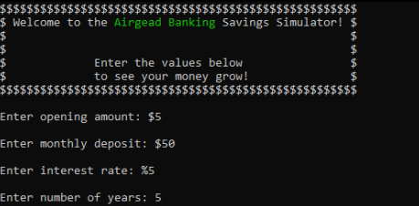
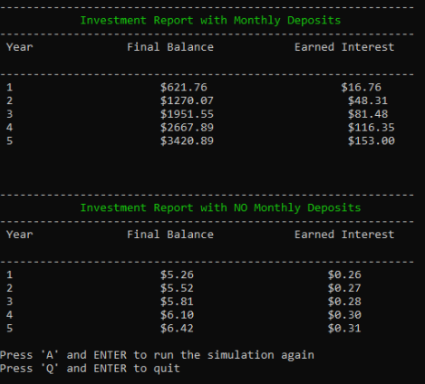

# CS-210 Project 2 - Airgead Banking Calculator
Designed to provide school students with proper financial literacy skills, the Airgead Banking Savings Simulator provides an outlook to how you choose to invest. 

### Functionality
When opened, the user is prompted to enter;
1. Opening deposit amount
2. Monthly deposit amount
3. Interest Rate
4. Number of years to calculate

With the entered values, the program will create two reports, each displaying the year, final balance, and earned interest.

The first report simulates a recurring monthly deposit (specified from the user on the beginning prompt), while the second report simulates only the opening deposit with no future deposits.

